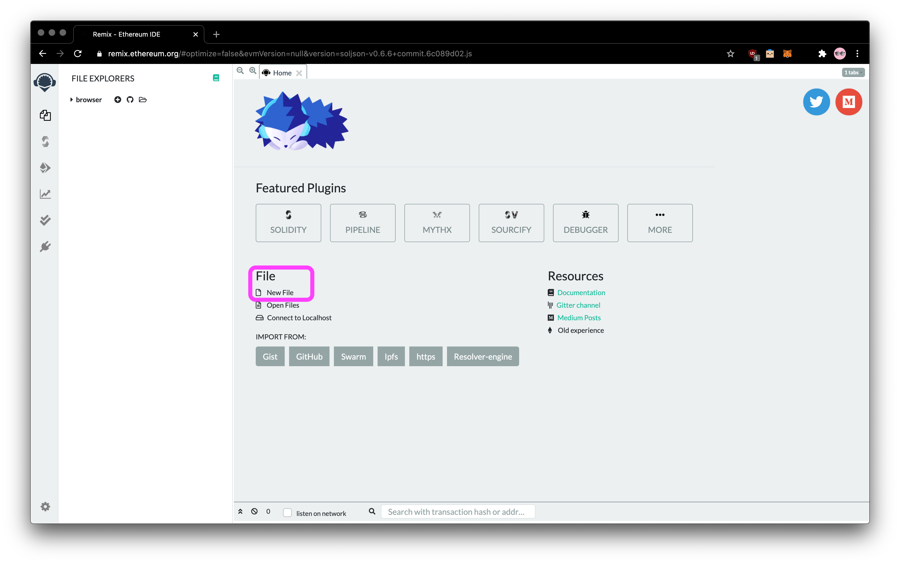
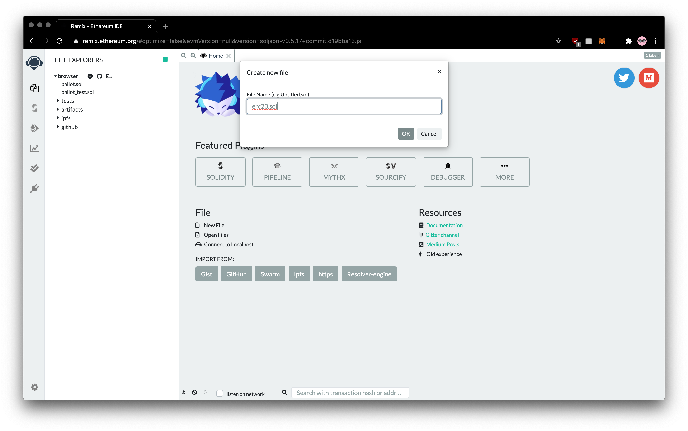
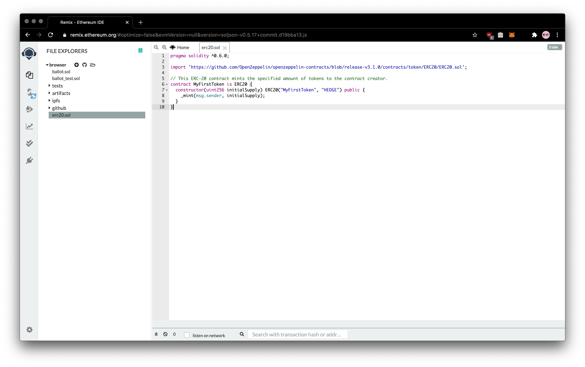
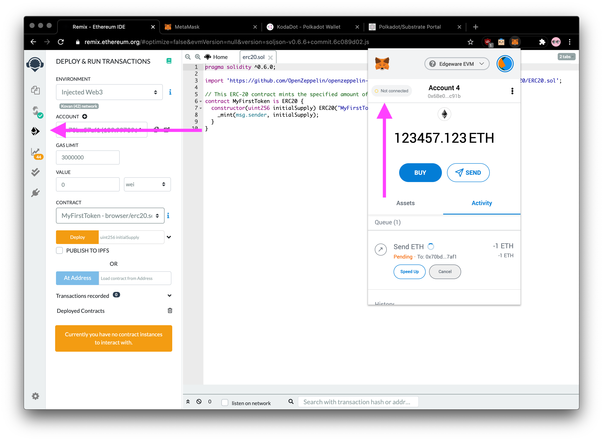
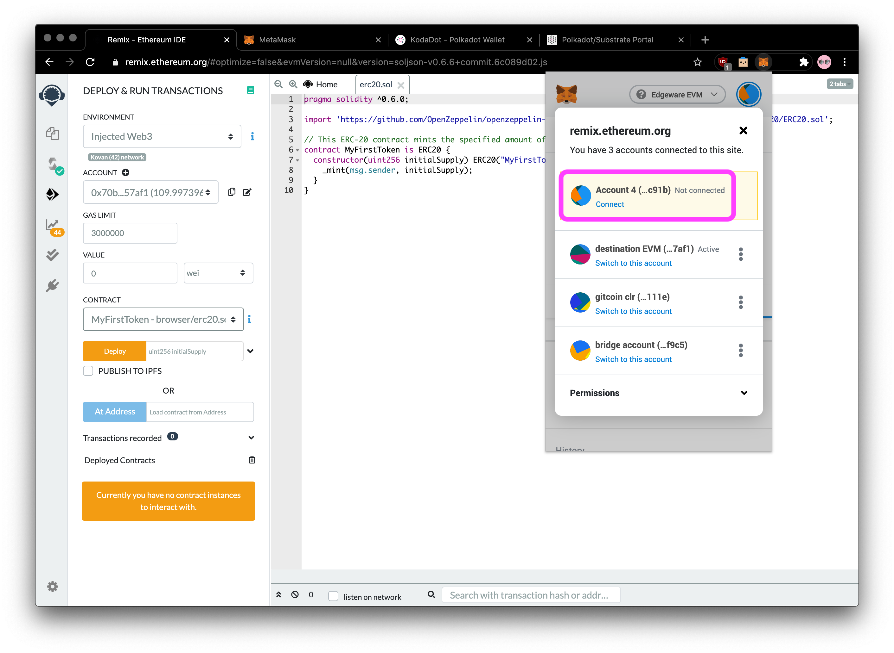
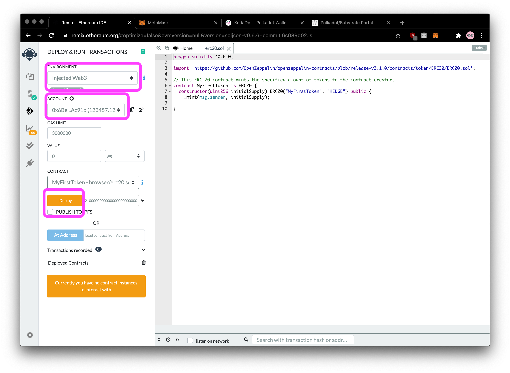
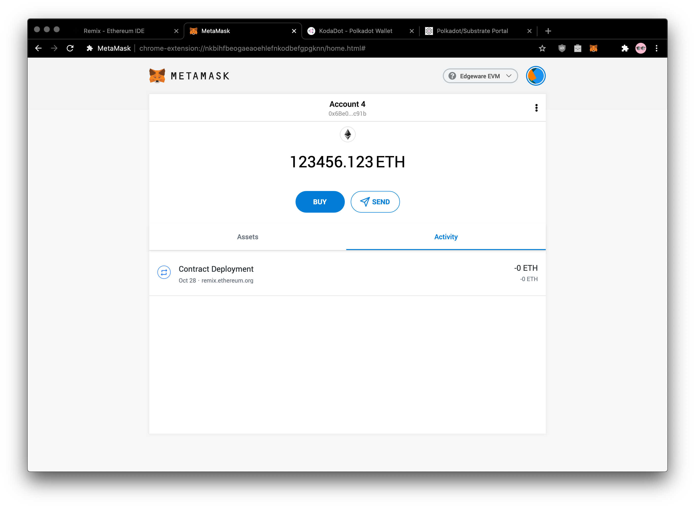
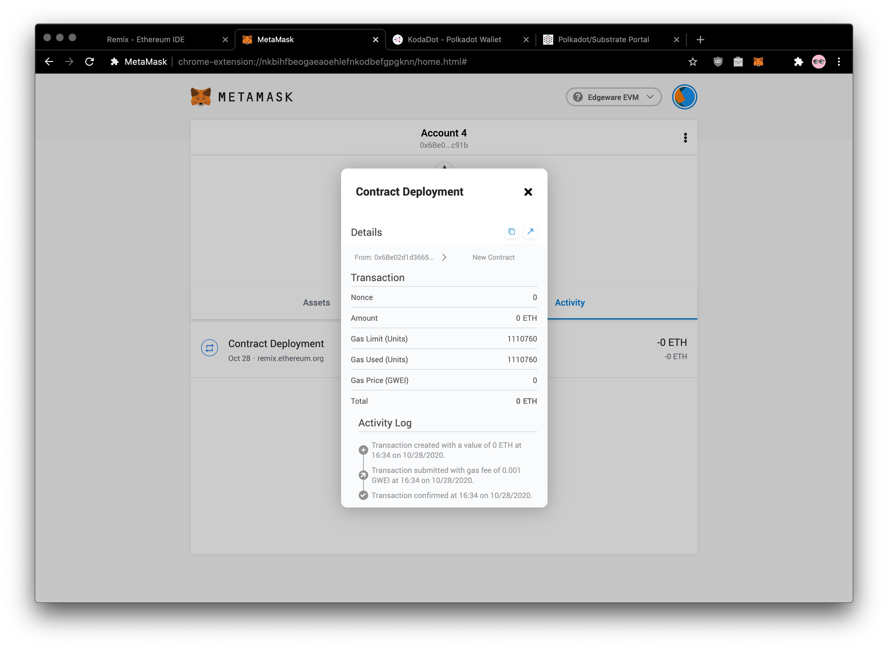

### Introduction 

This guide walks through the process of creating and deploying a Solidity-based smart contract to a Edgeware dev node using the [Remix IDE](https://remix.ethereum.org/). Remix is one of the commonly used development environments for smart contracts on Ethereum. Given Edgeware’s Ethereum compatibility features, Remix can be used directly with a Edgeware node.

This guide assumes that you have a running local Edgeware node running in `--dev` mode, and that you have a MetaMask installation configured to use this local node. [You can find instructions for running a local Edgeware node](4/setting-up-a-local-node.md) and [to configure MetaMask for Edgeware](4/interacting-with-a-Edgeware-node-using-metamask.md).

### Interacting With Edgeware Using Remix

[Open Remix](https://remix.ethereum.org/) and click on the `New File`



Name your file, in our case we've named it `erc20.sol` - yes, that [famous token standard](https://eips.ethereum.org/EIPS/eip-20)



Now add code. Here we are using simple ERC-20 contract based on the current Open Zeppelin ERC-20 template. It creates `MyFirstToken` with symbol `HEDGE` and mints the entirety of the initial supply to the creator of the contract. 

```javascript
pragma solidity ^0.6.0;

import 'https://github.com/OpenZeppelin/openzeppelin-contracts/blob/release-v3.1.0/contracts/token/ERC20/ERC20.sol';

// This ERC-20 contract mints the specified amount of tokens to the contract creator.
contract MyFirstToken is ERC20 {
  constructor(uint256 initialSupply) ERC20("MyFirstToken", "HEDGE") public {
    _mint(msg.sender, initialSupply);
  }
}
```



On the left sidebar, you will click on Solidity compiler and Compile erc20.sol 

```
Solidity Compiler >>> Compile Contract
```


Now click to the `Deploy & Run Transactions` on the left in the sidebar and open Metamask to check if is our account connected. If it's connected you can skip to next steps



Select our account, in this case it's `Account 4` and click on **connect**



You will now head to deploy contract. Just before that, make sure you've set set **ENVIRONMENT** to `Injected Web3` and Account that we've imported. Hint, it should have some Eth. To the input next deploy input `initialSupply`, in our case it's 21M. Since this contract uses the default of 18 decimals, the value you will put there is `21000000000000000000000000`



You will hit **confirm**! 


You will see your contract has been successfully deployed. 



You can see your contract deployment details, that has been successfully deployed on Edgeware EVM



You can now click to call functions like `decimals`, `name`, `symbol`, `totalSupply`


### What's next?

You can copy your contracts address and add it to Metamask to play out! Have fun, stay safe!

### We want to hear from you

This is obviously a simple example, but it provides context for how you can start working with Edgeware and how you can try out it's Ethereum compability features. We are interested in hearing abou your experience and following the steps in this guide or your experience trying other Etheruem-based tools with Edgeware. [Feel free to join us in the channels (Discord, Element, Telegram)](https://linktr.ee/edg_developers). We would love to hear your feedback on Edgeware EVM and answer any questions that you may have.