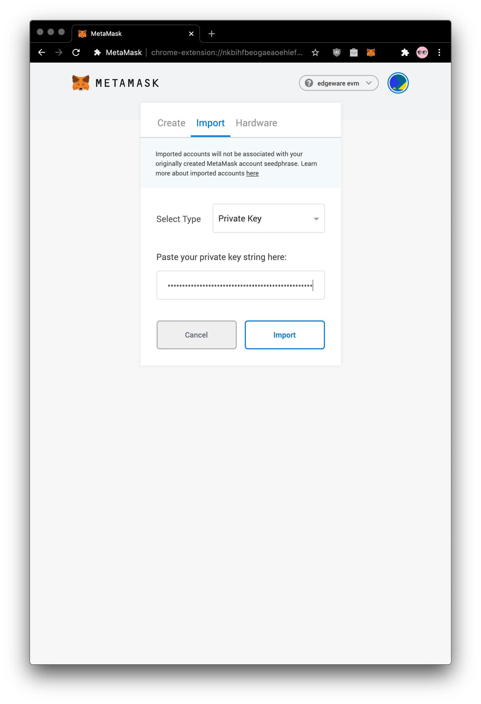
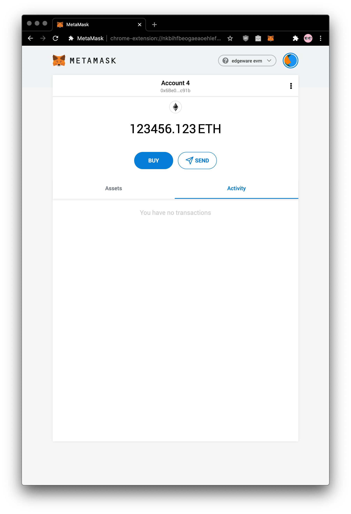
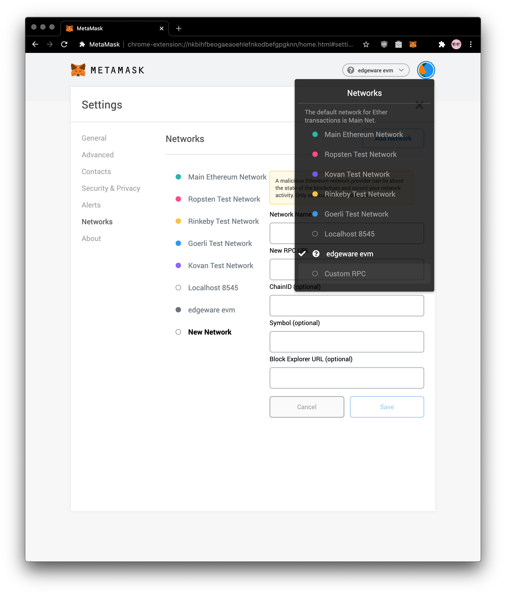
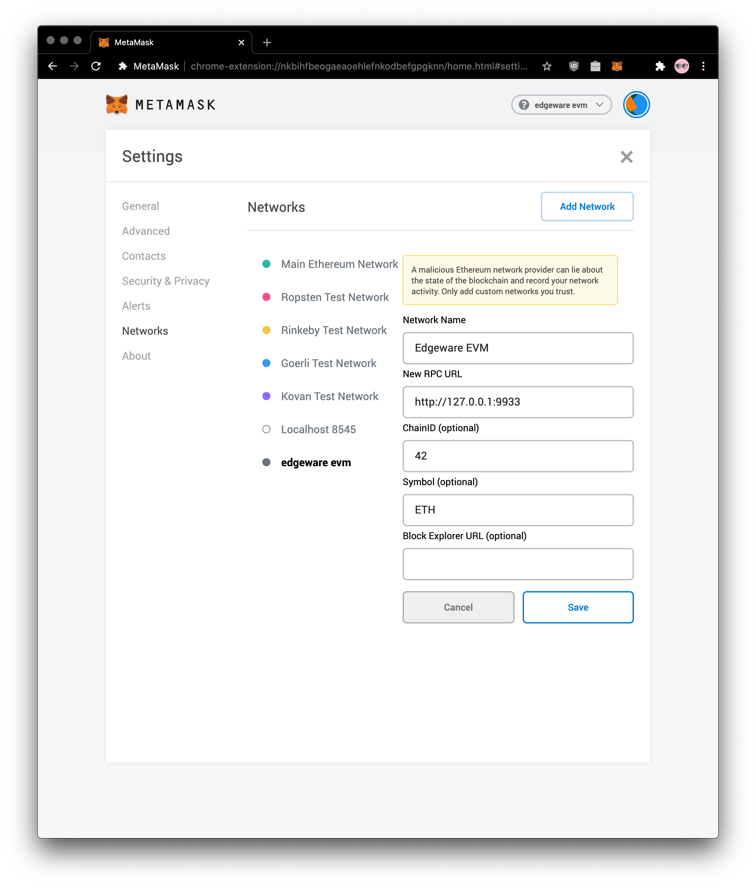
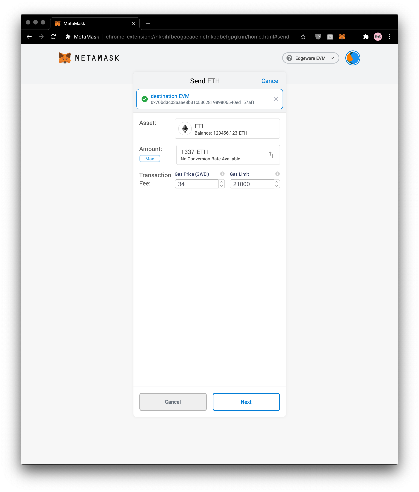
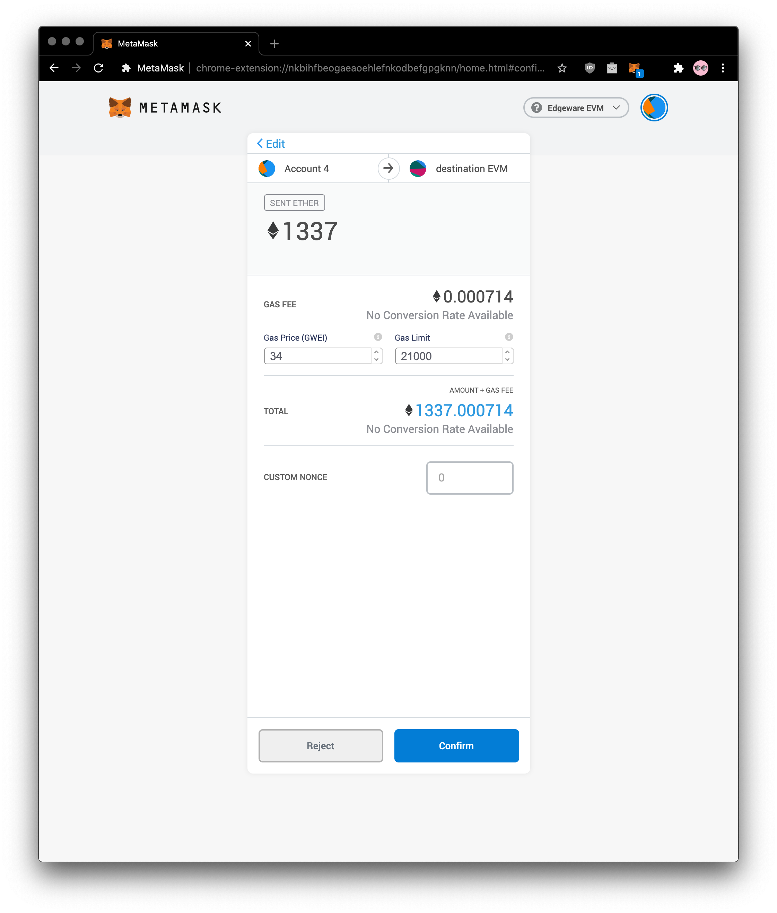
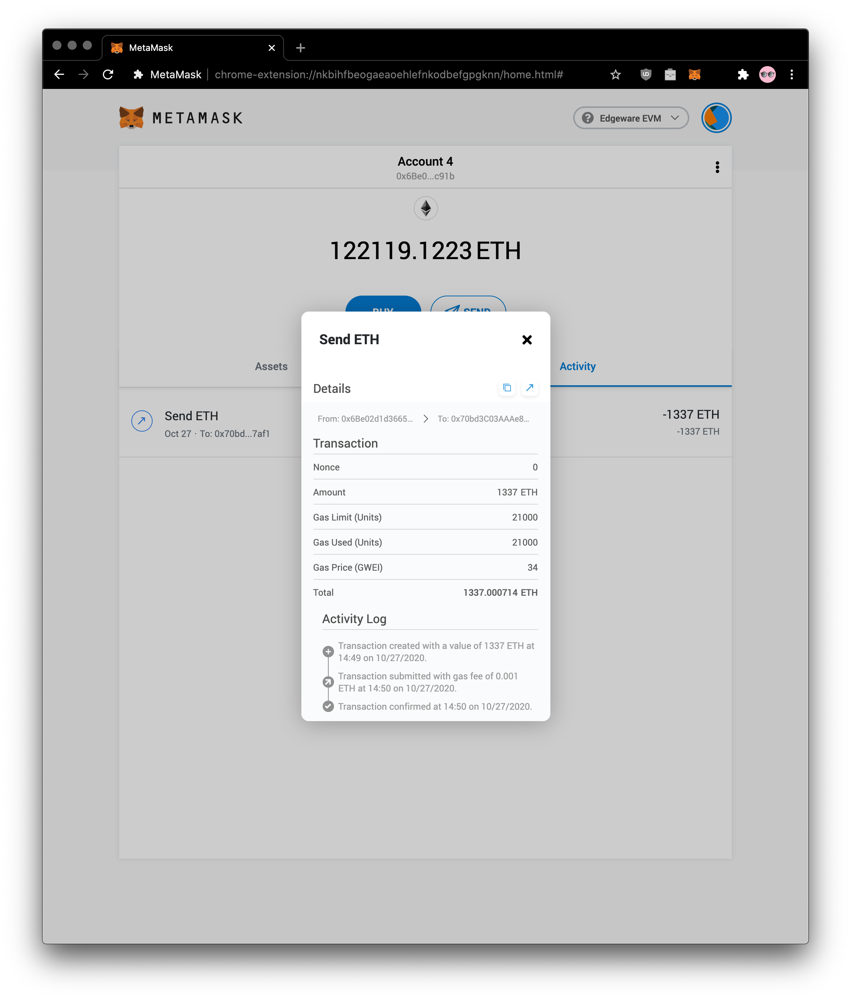

### Introduction

This guide will show you steps for using a self-contained Edgeware dev node to send tokens between EVM accounts with Metamask. 
To setup your own local node, learn more at this tutorial.

In this tutorial we will use the web3 rpc endpoints to interact with Edgeware

### Install the MetaMask Extension

First, we start with a fresh and default [Metamask installation from the Chrome store](https://chrome.google.com/webstore/detail/metamask/nkbihfbeogaeaoehlefnkodbefgpgknn?hl=en). Follow the "Get Started" guide, where you need to create a wallet, set a password and store your secret backup phrase. (this gives direct access to your funds, so make sure to store these in a secure place). 

### Import Developer Account

Once completed, we will import our dev account. For easier interaction, you can [expand Metamask view to dedicated tab](chrome-extension://nkbihfbeogaeaoehlefnkodbefgpgknn/home.html#). Click on upper right corner for accounts and hit `Import Account`: 

We have prefunded developer account for this purpose:

Private Key: `99B3C12287537E38C90A9219D4CB074A89A16E9CDB20BF85728EBD97C343E342`

Address: `0x6Be02d1d3665660d22FF9624b7BE0551ee1Ac91b`

On the import screen, select **"Private Key"** and paste there private key listed above and hit **Import**: 

You should see that account imported with wild balance (123456.123E) for our needs, in our case it's **Account 4**, it may differ in your enviroment.

### Connect to the Local Edgeware Developer Node

Now let's connect MetaMask to our locally running Edgeware EVM node. On upper right, hit Networks and click Custom RPC

Put there credentials 
Network Name: `Edgeware EVM`
New RPC URL: `http://127.0.0.1:9933`
ChainID: `42`

and hit **Save** button. Your can see it in figure below

### Make a Transfer

Now to verify your setup, you can try to make transfer between accounts. Don't worry, it's free! ;)

As new account, you should notice Nonce should be 0

Once is transaction in the block, you should see confirmed transaction like this 

### We want to hear from you

This is obviously a simple example, but it provides context for how you can start working with Edgeware and how you can try out it's Ethereum compability features. We are interested in hearing abou your experience and following the steps in this guide or your experience trying other Etheruem-based tools with Edgeware. [Feel free to join us in the channels (Discord, Element, Telegram)](https://linktr.ee/edg_developers). We would love to hear your feedback on Edgeware EVM and answer any questions that you may have.